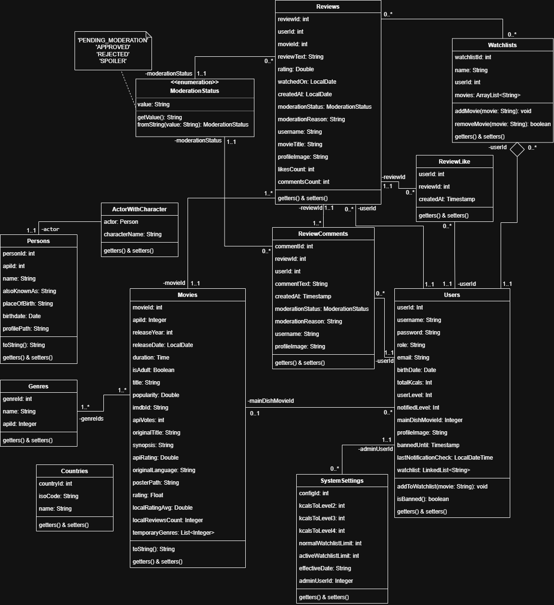

**Descripcion corta:**  
  FatMovies es una red social interactiva para cinéfilos. Permite descubrir películas, gestionar una watchlist y compartir reseñas. Cuenta con un sistema de gamificación donde los usuarios ganan "Kcals" mediante likes para subir de nivel. Ofrece un feed social personalizado, recomendaciones con Machine Learning (Apache Mahout) y moderación automática mediante IA (Gemini) que bloquea lenguaje tóxico y oculta spoilers, garantizando una comunidad sana..
  
**Diagrama Entidad Relacion:**

**Diagrama de Clases:**

**Link a las capturas de pantalla:** [Capturas de pantalla](https://drive.google.com/drive/folders/111IA1zWep-r24m1XK9N1K25jLqsKUhdA)

**Regularidad:**

| Requerimiento | Detalle/Listado de casos incluidos |
| :---- | :---- |
| ABMC simple | CRUD - Persona   CRUD - Usuario   CRUD - Género   CRUD - País |
| ABMC dependiente | CRUD - Película (depende de Género, Persona y País)    CRUD - Configuracion(depende de usuario) |
| CU NO-ABMC | **C.U.U. Hacer una reseña a una película**   (Verificando que sea la primer reseña de ese usuario para esa película, es decir, no puede haber más de dos reseñas por usuario para cada película.)    **C.U.U. Hacer una WatchList**   (El usuario puede agregar a su watchlist peliculas que desea ver mas tarde, el mismo podra añadir peliculas a las cuales ya le realizo una reseña ya que puede querer verlas denuevo. Se verifica que al agregar una pelicula el usuario no supere el limite de peliculas por watchlist que tiene dependiendo del nivel del usuario.) |
| Listado simple | \- |
| Listado complejo | Listado de películas por género,año y nombre muestra nombre de película, valoracion \=\> detalle muestra la puntuacion de tmdb y la de nuestra api, mas las reseñas y otra informacion de la pelicula como la descripcion, actores,etc. |

**Aprobación Directa:**

| Requerimiento | Detalle/Listado de casos incluidos |
| :---- | :---- |
| ABMC | CRUD - Persona   CRUD - Configuracion   CRUD - Usuario   CRUD - Género   CRUD - País   CRUD - Película |
| CU “Complejo” (nivel resumen) | **C.U.R. Feed**   **C.U.U.1: Recomendación de películas:** El sistema recomendará al usuario una cierta cantidad de películas en base a las películas que vió, con un algoritmo sencillo.   **C.U.U.2: Seguir Usuarios:** El usuario podrá buscar usuarios por su nombre, ver sus últimas reseñas e información importante de ellos, y tendrá la posibilidad de seguirlos. Al seguir un usuario podrás ver en tu página de seguidores, cada vez que este publique una reseña.   **C.U.U.3: Likear Reseñas:** El usuario podrá valorar reseñas que le parecen buenas otorgándole un like. Los usuarios tienen niveles y reciben 500 kcals por cada like recibido de una reseña propia, al superar ciertos hitos, el usuario irá subiendo de nivel y recibiendo recompensas como una watchlist más grande, la posibilidad de elegir una película favorita, un borde en su foto de perfil, un borde en sus reseñas y la posibilidad de aparecer diferenciado a los demás usuarios.    **C.U.R. Sistema de comentarios y moderación:**   **C.U.U.1: Comentar Reseñas** El usuario podrá comentar una reseña para añadir información que considere importante, corregir o simplemente dar su apoyo al autor de la reseña. Estos comentarios están moderados mediante IA y en caso de ser ofensivos el usuario recibirá un baneo.   **C.U.U.2: Recibo de Feedback** El usuario tendrá un apartado con forma de ticket de cine el cual tendrá un puntito rojo cuando tenga un like, comentario o seguidor nuevo en su cuenta.   **C.U.U.3: Moderación de reseñas** Las reseñas serán moderadas con IA para evitar reseñas con spoilers y/o lenguaje ofensivo y racista. Las reseñas con spoiler quedarán marcadas para que los usuarios elijan si verlas o no y las ofensivas no seran mostradas ademas de que el autor recibe un baneo por una ciertas cantidad de días. |
| Listado complejo | \-Listado de películas por género, muestra nombre de película, género , nombre de director \=\> detalle muestra las diferentes puntuaciones de cada medio para esa película    \-Listado de reseñas de una película por cantidad de likes, rating , fecha \=\> detalle muestra los comentarios de la reseña |
| Nivel de acceso | \-Admin   \-Usuario |
| Manejo de errores | – |
| requerimiento extra obligatorio (\*\*) | \-Manejo de archivos. Los usuarios podrán subir una foto de perfil, la cual pasa por una moderación mediante una api externa que rechaza fotos +18, violentas o que contengan armas.   \-Envío de mails: El usuario recibirá mail para recuperar su contraseña y cada vez que suba de nivel.   \-Uso de Custom exceptions: Utilización de Error factory, para mostrar mensajes de error más demostrativos. |
| publicar el sitio | – |

## 1. Narrativa del Sistema

El sistema consiste en una red social interactiva y plataforma de gestión de contenido diseñada específicamente para cinéfilos. Los usuarios se registran en la plataforma para descubrir películas, llevar un registro de su visualización (Watchlist) y compartir sus opiniones a través de reseñas y calificaciones.

A diferencia de las bases de datos de películas tradicionales, FatMovies se centra en la interacción social y la gamificación. El ecosistema motiva a los usuarios a generar contenido de calidad mediante un sistema de experiencia basado en calorías ("Kcals"). Cada vez que una reseña recibe una valoración positiva (Like) de otro miembro de la comunidad, su autor gana Kcals, lo que le permite ascender a través de distintos Niveles de Apetito (Nivel 1 al 4). Al alcanzar niveles superiores, los usuarios desbloquean beneficios estéticos en su perfil, como bordes personalizados y la posibilidad de exhibir su película favorita absoluta bajo la categoría de "Plato Principal", etc.

La plataforma promueve una comunidad sana y libre de interrupciones mediante la integración de Inteligencia Artificial (API de Gemini). Cada reseña y comentario publicado pasa por la Moderación con IA que analiza el texto contra la sinopsis oficial de la película. Si la IA detecta "Spoilers", la reseña se publica pero se oculta visualmente mediante un filtro de desenfoque. Si detecta lenguaje ofensivo o ataques personales, el contenido es rechazado y el autor es suspendido temporalmente.

La gestión diaria permite a los usuarios interactuar dinámicamente: pueden seguir a otros creadores de contenido para alimentar su muro personalizado ("Comunidad"), comentar debates, y bloquear a usuarios indeseados. Finalmente, el descubrimiento de nuevo contenido está potenciado por un Motor de Recomendaciones basado en Machine Learning (Apache Mahout), que analiza los gustos, calificaciones y el historial del usuario para sugerirle sus próximas películas de forma inteligente.

---

## 2. Reglas de Negocio (RN)

### 1. Registro y Usuarios

**1.1.** Los usuarios se identifican en el sistema mediante un nombre de usuario y correo electrónico únicos.

**1.2.** Existen dos roles definidos: Usuario (miembro estándar de la comunidad) y Administrador (encargado de configurar los parámetros globales del sistema).

**1.3.** Un usuario puede ser sancionado (Baneado). Durante el período de sanción, el usuario puede iniciar sesión en modo "solo lectura" para navegar, pero tiene prohibido crear, editar o comentar reseñas.

### 2. Reseñas de Películas

**2.1.** Un usuario solo puede escribir una (1) reseña por cada película. Si desea cambiar su opinión, debe editar la reseña existente.

**2.2.** Toda reseña debe contener una calificación obligatoria en un rango de 0 a 5.0 (con incrementos de 0.5).

**2.3.** El cuerpo de texto de la reseña debe poseer un mínimo de 10 caracteres.

**2.4.** Si un usuario escribe una reseña sobre una película que se encontraba en su "Watchlist" (Lista de pendientes), el sistema la elimina automáticamente de dicha lista al publicarse la reseña.

### 3. Sistema de Moderación IA

**3.1.** Todo contenido de texto (Reseñas y Comentarios) nace con estado "Pendiente de Moderación" y es evaluado asíncronamente por la IA.

**3.2.** Si la IA determina que el contenido revela detalles cruciales de la trama, se clasifica como "SPOILER" y se le aplica un filtro visual (blur) en la interfaz, requiriendo el consentimiento explícito del lector para visualizarlo.

**3.3.** Si la IA determina que el contenido posee lenguaje ofensivo, racista o tóxico, se clasifica como "RECHAZADO".

**3.4.** La clasificación de contenido como "RECHAZADO" dispara automáticamente una sanción (Ban) de 7 días calendario para el autor del mismo.

### 4. Gamificación (Kcals y Niveles)

**4.1.** Todos los usuarios inician en el Nivel 1 con 0 Kcals acumuladas.

**4.2.** Por cada "Like" recibido en una de sus reseñas, el autor suma 500 Kcals.

**4.3.** Si un usuario retira su "Like" de una reseña, se le restan 500 Kcals al autor (el total de Kcals nunca puede ser menor a 0).

**4.4.** Un usuario no recibe Kcals por dar "Like" a sus propias reseñas.

**4.5.** El sistema evalúa constantemente el total de Kcals del usuario contra los umbrales configurados por el Administrador para ascender o descender su Nivel (Nivel 2, Nivel 3 y Nivel 4).

**4.6.** Al llegar al nivel 2 los usuarios obtienen un agrandamiento en su watchlist.

**4.7.** Al alcanzar el nivel 3 los usuarios obtienen un borde personalizado con la temática de la pagina para su foto de perfil y la opción de elegir su película principal en su perfil.

**4.8.** Al lograr el 4to y último nivel, los usuarios reciben un borde especial para sus reseñas basado en la estética de la página y además un reconocimiento de sus reseñas para demostrar su conocimiento con respecto a los demás usuarios.

### 5. Interacción Social (Comunidad)

**5.1. Seguimiento:** Un usuario no puede seguirse a sí mismo. Al seguir a un usuario, sus reseñas aparecerán de forma prioritaria en la "comunidad" del seguidor.

**5.2. Bloqueo:** Un usuario puede bloquear a otro. El bloqueo es de exclusión mutua: si el Usuario A bloquea al Usuario B, se eliminan los seguimientos entre ambos, el Usuario A no verá las reseñas/comentarios del Usuario B, y el Usuario B no verá las del Usuario A.

**5.3. Plato Principal:** Exclusivo para usuarios de Nivel 3 o superior. Permite seleccionar una (1) película del catálogo para destacarla de forma especial en la cabecera de su perfil público.

### 6. Motor de Recomendaciones (Apache Mahout)

**6.1.** El sistema genera recomendaciones personalizadas de películas evaluando la matriz de similitud de calificaciones entre usuarios.

**6.2.** Si un usuario es nuevo o no posee la cantidad mínima de reseñas requeridas por el algoritmo para encontrar patrones, el sistema le avisa de la situacion.

### 7. Configuración Global (Administrador)

**7.1.** El administrador es el único capaz de modificar los umbrales de experiencia (Kcals necesarias para alcanzar los niveles 2, 3 y 4).

**7.2.** El administrador define el límite máximo de películas que un usuario puede tener en su Watchlist simultáneamente dependiendo de los niveles. La actualización de estas reglas impacta inmediatamente en toda la comunidad.

---

## 3. Casos de Uso

### CUR-01: Ciclo de Interacción Social y Consumo del Usuario Registrado

**Meta:** Que el usuario registrado experimente el ciclo completo de la plataforma: descubrir contenido (vía recomendaciones o feed), gestionar su lista de pendientes, generar reseñas moderadas por IA, interactuar con la comunidad (seguir, bloquear, dar like), ganar experiencia (Kcals) y personalizar su perfil.

**Actor principal:** Usuario Registrado

**Otros actores:** Sistema de Moderación IA (Gemini), Motor de Recomendaciones (Apache Mahout)

**Precondiciones de negocio:**
- La configuración de umbrales de Kcals por nivel se encuentra vigente.
- El usuario se encuentra logueado.

**Precondiciones de sistema:**
- El usuario ingresado está registrado con rol "user" y con sanción (ban) nula.

**Disparador:**
El usuario inició sesión en el sistema con sus credenciales.

**Camino básico:**
1. Cuando el usuario accede a su página de comunidad, el sistema muestra las reseñas recientes de los usuarios que sigue invocando \<CU-06: Consultar feed “Comunidad”\>.
2. Cuando el usuario desea descubrir nuevo contenido basado en sus gustos, accede a la página de películas, el sistema muestra películas recomendadas invocando \<CU-08: Obtener Recomendaciones de Películas\>.
3. Cuando el usuario encuentra una película de interés que aún no vio, el sistema la registra en su watchlist invocando \<CU-05 Gestionar Watchlist\>.
4. Cuando el usuario decide escribir su opinión sobre una película ya vista, el sistema la modera y guarda invocando \<CU-01 Escribir Reseña\>.
5. Cuando el usuario lee reseñas en el feed y valora una positivamente, el sistema coloca el like en la reseña y recalcula el nuevo nivel del autor invocando \<CU-02 Dar like a una reseña\>.
6. Cuando el usuario se interesa por el contenido de un autor en particular, el sistema invoca \<CU-03 Seguir a un Usuario\>.
7. Cuando el usuario recibe interacciones indeseadas de otro miembro, el sistema impide la visualizacion mutua de contenido ejecutando \<CU-07 Bloquear Usuario\>.
8. Cuando el usuario ha alcanzado el Nivel 3 y decide destacar su película favorita, el sistema la publica en su perfil invocando \<CU-04 Elegir Plato Principal\>.
9. Cuando el usuario recibe una nueva notificacion (like, comentario, seguidor) de la cual no esta notificado el sistema invoca \<CU-09 Mostrar Notificaciones\>.

**Caminos alternativos:**
\<vacío\>

**Post-condiciones de negocio:**
- **Éxito:** El usuario descubrió películas, interactuó sanamente con la comunidad, y su perfil refleja su actividad y nivel actualizado.
- **Éxito alternativo:** El usuario solo consumió contenido y gestionó su watchlist sin interactuar socialmente.
- **Fracaso:** El usuario fue bloqueado por el sistema debido a comportamiento tóxico (reseña racista/ofensiva) y expulsado de la sesión.

**Post-condiciones de sistema:**
- **Éxito:** Ver post-condiciones de los casos de uso CU-01 al CU-08.
- **Éxito alternativo:** \<Omitido\>
- **Fracaso:** \<vacío\>

---

### CASOS DE USO DE USUARIO PRINCIPALES:

#### CU-01: Escribir Reseña (con Moderación IA)

**Meta:** Que el usuario registrado exhiba su opinión sobre una película, la cual pasará por el filtro de IA para clasificar spoilers o sancionar contenido ofensivo/racista.

**Actor principal:** Usuario Registrado

**Otros actores:** Sistema de Moderación IA (Gemini)

**Precondiciones de negocio:**
- El usuario tiene una sesión activa y no posee una sanción (ban) vigente.
- El usuario no ha escrito previamente una reseña para esa película.

**Precondiciones de sistema:**
- El usuario ingresado está registrado con la fecha de bannedUntil nula o expirada.
- No existe una reseña registrada para la combinación usuario-película.

**Disparador:**
Cuando el usuario selecciona la opción de escribir una reseña sobre una película específica.

**Camino básico:**
1. Cuando el usuario selecciona escribir una reseña, el sistema presenta el formulario asociado a la película.
2. Cuando el usuario ingresa el texto de la reseña y la calificación, el sistema recibe los datos y valida que el texto posea las longitudes permitidas y la calificación esté en rango.
3. El sistema registra la reseña con estado PENDING_MODERATION.
4. El sistema valida si la película figuraba en la watchlist del usuario, para luego eliminarla de la misma.
5. El sistema envía la reseña al Sistema de Moderación IA.
6. El Sistema de Moderación IA analiza el texto comparándolo con la sinopsis para detectar spoilers y evalúa la presencia de lenguaje ofensivo/racista.
7. El sistema actualiza el estado de moderación de la reseña a APPROVED y la expone a la comunidad.

**Caminos alternativos:**

**7.a. \<Reemplaza paso 7\> La IA detecta que la reseña contiene spoilers:**
- 7.a.1. El sistema actualiza el estado de la reseña a SPOILER.
- 7.a.2. El sistema expone la reseña blureada a la comunidad para que los usuarios elijan si verla.
- 7.a.3. FCU.

**7.b. \<Reemplaza paso 7\> La IA detecta que la reseña contiene lenguaje ofensivo o racista:**
- 7.b.1. El sistema actualiza el estado de la reseña a REJECTED.
- 7.b.2. El sistema aplica una sanción al usuario autor, registrando la fecha de bannedUntil por 7 días.
- 7.b.3. FCU.

**Post-condiciones de negocio:**
- **Éxito:** La reseña se publica limpia.
- **Éxito alternativo:** La reseña se publica con la marca visual de spoiler.
- **Fracaso:** La reseña es rechazada y el usuario queda bloqueado temporalmente por toxicidad.

**Post-condiciones de sistema:**
- **Éxito:** La reseña ingresada está registrada con estado APPROVED.
- **Éxito alternativo:** La reseña ingresada está registrada con estado SPOILER.
- **Fracaso:** La reseña ingresada está registrada con estado REJECTED. El usuario autor está registrado con estado Baneado.

---

#### CU-02: Dar Like a una Reseña

**Meta:** Que el usuario valore positivamente una reseña, incrementando las Kcals y nivel del autor.

**Actor principal:** Usuario Registrado (Valorador)

**Otros actores:** Usuario Autor

**Precondiciones de negocio:**
- La reseña objetivo fue escrita por un usuario diferente.

**Precondiciones de sistema:**
- El usuario valorador ingresado está registrado.
- La reseña ingresada está registrada con estado APPROVED o SPOILER.

**Disparador:**
Cuando el usuario decide dar like a una reseña.

**Camino básico:**
1. Cuando el usuario decide otorgar like a una reseña no valorada previamente, el sistema recibe la solicitud.
2. El sistema registra el like y actualiza el contador de likes de la reseña.
3. El sistema recupera al usuario autor y le suma 500 Kcals a su total acumulado.
4. El sistema valida si el nuevo total de Kcals supera los umbrales del siguiente nivel y actualiza el totalKcals del autor.

**Caminos alternativos:**

**1.a. \<Reemplaza paso 1\> Cuando el usuario solicita quitar un like previamente otorgado:**
- 1.a.1. El sistema elimina el registro del like y resta 500 Kcals al autor.
- 1.a.2. El sistema valida los umbrales vigentes para verificar si el autor desciende de nivel.
- 1.a.3. El sistema actualiza el totalKcals y userLevel del autor. FCU.

**4.a. \<Reemplaza paso 4\> Cuando las Kcals superan el umbral del siguiente nivel:**
- 4.a.1. El sistema actualiza el totalKcals y el userLevel del autor al nuevo nivel alcanzado.

**Post-condiciones de sistema:**
- **Éxito:** El like ingresado está registrado. El usuario autor tiene el atributo totalKcals actualizado.
- **Éxito alternativo 1:** El like correspondiente está eliminado.
- **Éxito alternativo 2:** El usuario autor tiene los atributos totalKcals y userLevel actualizados.
- **Fracaso:** \<vacío\>

---

#### CU-03: Seguir a un Usuario

**Meta:** Establecer una relación de seguimiento para ver las reseñas de otro miembro en el Feed "Comunidad".

**Actor principal:** Usuario Seguidor

**Otros actores:** Usuario Seguido

**Precondiciones de sistema:**
- Ambos usuarios ingresados están registrados.
- No existe un registro de bloqueo entre ambos usuarios.

**Disparador:**
Cuando el usuario solicita seguir el perfil de otro miembro.

**Camino básico:**
1. Cuando el usuario solicita seguir a otro miembro, el sistema valida que no sean el mismo usuario.
2. El sistema valida que no existe una relación de seguimiento activa previa.
3. El sistema registra la nueva relación de seguimiento y registra una notificación para el usuario seguido.

**Caminos alternativos:**

**2.a. \<Reemplaza paso 2\> Ya existe una relación de seguimiento activa:**
- 2.a.1. El sistema elimina la relación de seguimiento (acción de dejar de seguir). FCU.

**Post-condiciones de sistema:**
- **Éxito:** La relación de seguimiento ingresada está registrada.
- **Éxito alternativo:** La relación de seguimiento correspondiente está eliminada.
- **Fracaso:** \<vacío\>

---

#### CU-04: Elegir Plato Principal

**Meta:** Destacar una película favorita en el perfil.

**Actor principal:** Usuario Registrado

**Precondiciones de sistema:**
- El usuario ingresado está registrado con nivel mayor o igual a 3.
- La película ingresada está registrada.

**Disparador:**
Cuando el usuario decide destacar una película en su perfil.

**Camino básico:**
1. Cuando el usuario selecciona una película de su agrado para destacar, el sistema valida el nivel del usuario.
2. El sistema registra la película seleccionada en el perfil del usuario.

**Caminos alternativos:**

**1.a. \<Reemplaza paso 1 y 2\> Cuando el usuario decide remover el Plato Principal actual:**
- 1.a.1. El sistema actualiza el atributo mainDishMovieId a nulo y la película desaparece del perfil. FCU.

**Post-condiciones de sistema:**
- **Éxito:** El usuario ingresado está registrado con el atributo mainDishMovieId actualizado al ID de la película.
- **Éxito alternativo:** El usuario ingresado está registrado con el atributo mainDishMovieId en nulo.
- **Fracaso:** \<vacío\>

---

#### CU-05: Gestionar Watchlist

**Meta:** Agregar o quitar películas de la lista de pendientes para ver.

**Actor principal:** Usuario Registrado

**Precondiciones de sistema:**
- El usuario ingresado está registrado.
- La película ingresada está registrada.

**Disparador:**
Cuando el usuario selecciona una película para su watchlist.

**Camino básico:**
1. Cuando el usuario indica su interés por guardar una película, el sistema valida que la película no exista previamente en la watchlist del usuario.
2. El sistema registra la relación entre la película y la watchlist del usuario.

**Caminos alternativos:**

**1.a. \<Previo\> La película ya existe en la watchlist:**
- 1.a.1. El sistema avisa que la película ya se encuentra en la watchlist del usuario. FCU.

**2.a. \<Posterior\> El usuario superó sus límites para watchlist:**
- 2.a.1. El sistema avisa al usuario que superó el límite. FCU.

**Post-condiciones de sistema:**
- **Éxito:** La relación en la watchlist está registrada.
- **Éxito alternativo:** \<vacío\>
- **Fracaso:** El usuario superó su límite de películas en la watchlist.

---

#### CU-06: Consultar Feed "Comunidad"

**Meta:** Mostrar al usuario las reseñas publicadas exclusivamente por los usuarios a los que sigue, filtrando a los bloqueados.

**Actor principal:** Usuario Registrado

**Precondiciones de sistema:**
- El usuario ingresado está registrado.
- Existen reseñas registradas con estado APPROVED o SPOILER que no sean del usuario.

**Disparador:**
Cuando el usuario accede a la sección de inicio o feed.

**Camino básico:**
1. Cuando el usuario ingresa a su sección principal, el sistema recupera la lista de usuarios seguidos por el actor.
2. El sistema valida y excluye del listado a aquellos usuarios que posean un registro de bloqueo con el actor.
3. El sistema recupera y muestra las reseñas ordenadas cronológicamente de los usuarios filtrados.

**Caminos alternativos:**

**1.a. \<Reemplaza\> El usuario no sigue a nadie o sus seguidos no tienen reseñas:**
- 1.a.1. El sistema recupera y muestra el feed general (reseñas más populares de toda la plataforma). FCU.

**Post-condiciones de sistema:**
- **Éxito:** \<vacío\> (Solo visualización de estado de la memoria).
- **Éxito alternativo:** \<vacío\>
- **Fracaso:** \<Omitido\>

---

#### CU-07: Bloquear Usuario

**Meta:** Impedir permanentemente la interacción y visualización de contenido de un usuario molesto.

**Actor principal:** Usuario Registrado (Bloqueador)

**Otros actores:** Usuario Bloqueado

**Precondiciones de sistema:**
- Ambos usuarios ingresados están registrados.

**Disparador:**
Cuando el usuario decide restringir a otro miembro desde su perfil.

**Camino básico:**
1. Cuando el usuario solicita bloquear a otro miembro, el sistema valida que no exista un bloqueo activo previo en esa dirección.
2. El sistema registra la entidad de bloqueo desde el usuario bloqueador hacia el usuario bloqueado.
3. El sistema valida si existen relaciones de seguimiento entre ambos, para luego eliminarlas de la base de datos.

**Caminos alternativos:**

**1.a. \<Reemplaza\> Ya existía un bloqueo activo (acción de desbloquear):**
- 1.a.1. El sistema elimina el registro de bloqueo existente. FCU.

**Post-condiciones de sistema:**
- **Éxito:** El bloqueo ingresado está registrado. Las relaciones de seguimiento están eliminadas.
- **Éxito alternativo:** El bloqueo correspondiente está eliminado.
- **Fracaso:** \<vacío\>

---

#### CU-08: Obtener Recomendaciones de Películas (Apache Mahout)

**Meta:** Sugerir películas al usuario basándose en el análisis de sus gustos y reseñas mediante Machine Learning.

**Actor principal:** Usuario Registrado

**Otros actores:** Motor de Recomendaciones (Apache Mahout)

**Precondiciones de sistema:**
- El usuario ingresado está registrado.
- Existen reseñas con calificaciones registradas por el usuario.

**Disparador:**
Cuando el usuario ingresa a la sección de Películas.

**Camino básico:**
1. Cuando el usuario visualiza la sección de peliculas, el sistema delega la solicitud de análisis al Motor de Recomendaciones.
2. El Motor de Recomendaciones procesa la matriz de preferencias basada en las calificaciones del usuario y los patrones de otros usuarios similares.
3. El sistema recupera las películas sugeridas de la base de datos basándose en los identificadores devueltos por el motor.
4. El sistema presenta el listado de películas recomendadas al usuario.

**Caminos alternativos:**

**2.a. \<Reemplaza\> Cuando el usuario no posee suficientes reseñas para que el algoritmo encuentre patrones:**
- 2.a.1. El sistema valida que los datos son insuficientes para el algoritmo.
- 2.a.2. El sistema avisa la situación al usuario y lo alienta a realizar más reviews. FCU.

**Post-condiciones de sistema:**
- **Éxito:** \<vacío\> (Es un proceso de lectura y cálculo de datos en memoria).
- **Éxito alternativo:** \<vacío\>
- **Fracaso:** \<Omitido\>

---

#### CU-09: Mostrar Notificaciones

**Meta:** Que el usuario registrado se informe sobre las interacciones recientes (likes, comentarios y seguimientos) que otros miembros de la comunidad han realizado sobre su perfil o contenido. 

**Actor principal:** Usuario Registrado 

**Otros actores:** —

**Precondiciones de negocio:**
- El usuario está logueado.

**Precondiciones de sistema:**
- El usuario ingresado está registrado. 

**Disparador:**
El usuario decide revisar sus novedades e interacciones recientes.

**Camino básico:**
1. Cuando el usuario solicita consultar sus notificaciones, el sistema recupera las interacciones dirigidas a él (likes en sus reseñas, comentarios en sus reseñas y nuevos seguidores).
2. El sistema valida la fecha de última revisión de notificaciones del usuario contra la fecha de cada interacción para clasificarlas como nuevas o antiguas.
3. El sistema presenta el listado de notificaciones ordenadas cronológicamente al usuario, para luego actualizar la fecha de última revisión del usuario a la fecha y hora actuales.

**Caminos alternativos:**

**1.a. \<Previo\> El usuario recibe un like, comentario o nuevo seguidor:**
- 1.a.1. El icono de notificaciones se coloca con un punto rojo, para indicarle al usuario que tiene notificaciones sin revisar.
- 1.a.2. Sigue el paso 1.

**Post-condiciones de negocio:**
- **Éxito:** El usuario tomó conocimiento de la actividad de la comunidad respecto a su contenido y perfil.
- **Éxito alternativo:** El usuario comprobó que no tiene nueva actividad en su cuenta.
- **Fracaso:** \<Omitido\>

**Post-condiciones de sistema:**
- **Éxito:** El usuario ingresado está registrado con el atributo lastNotificationCheck actualizado a la fecha y hora de la consulta.
- **Éxito alternativo:** \<vacío\>
- **Fracaso:** \<vacío\>
