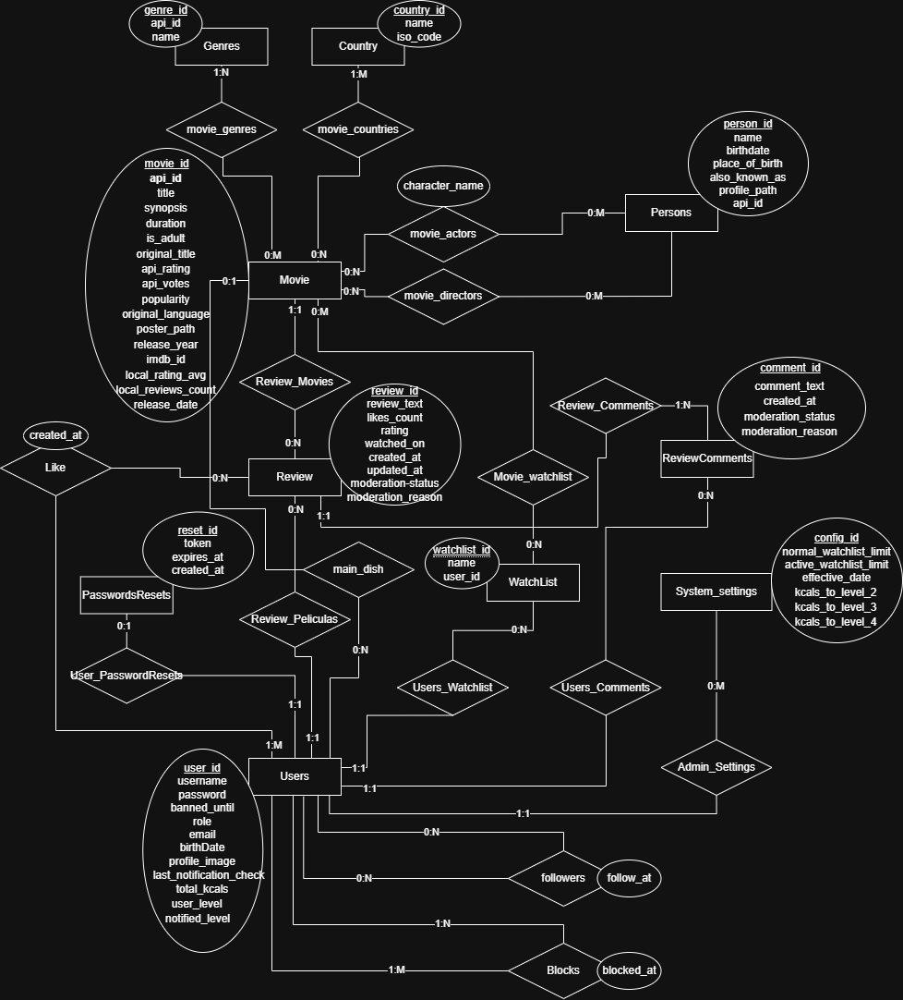

LetterBox look-a-like made in Java

**Integrantes:**  
Giacone, Alessandro \- 52664  
Mazalán, Ariel \- 52867  
Pacheco, Santiago \- 52831  
Ribotta, Tomás \- 52309 

**Descripcion corta:**  
  FatMovies es una red social interactiva para cinéfilos. Permite descubrir películas, gestionar una watchlist y compartir reseñas. Cuenta con un sistema de gamificación donde los usuarios ganan "Kcals" mediante likes para subir de nivel. Ofrece un feed social personalizado, recomendaciones con Machine Learning (Apache Mahout) y moderación automática mediante IA (Gemini) que bloquea lenguaje tóxico y oculta spoilers, garantizando una comunidad sana..
 

**Regularidad:**

| Requerimiento | Detalle/Listado de casos incluidos |
| :---- | :---- |
| ABMC simple | CRUD - Persona   CRUD - Usuario   CRUD - Género   CRUD - País |
| ABMC dependiente | CRUD - Película (depende de Género, Persona y País)    CRUD - Configuracion(depende de usuario) |
| CU NO-ABMC | **C.U.U. Hacer una reseña a una película**   (Verificando que sea la primer reseña de ese usuario para esa película, es decir, no puede haber más de dos reseñas por usuario para cada película.)    **C.U.U. Hacer una WatchList**   (El usuario puede agregar a su watchlist peliculas que desea ver mas tarde, el mismo podra añadir peliculas a las cuales ya le realizo una reseña ya que puede querer verlas denuevo. Se verifica que al agregar una pelicula el usuario no supere el limite de peliculas por watchlist que tiene dependiendo del nivel del usuario.) |
| Listado simple | \- |
| Listado complejo | Listado de películas por género,año y nombre muestra nombre de película, valoracion \=\> detalle muestra la puntuacion de tmdb y la de nuestra api, mas las reseñas y otra informacion de la pelicula como la descripcion, actores,etc. |

**Aprobación Directa:**

| Requerimiento | Detalle/Listado de casos incluidos |
| :---- | :---- |
| ABMC | CRUD - Persona   CRUD - Configuracion   CRUD - Usuario   CRUD - Género   CRUD - País   CRUD - Película |
| CU “Complejo” (nivel resumen) | **C.U.R. Feed**   **C.U.U.1: Recomendación de películas:** El sistema recomendará al usuario una cierta cantidad de películas en base a las películas que vió, con un algoritmo sencillo.   **C.U.U.2: Seguir Usuarios:** El usuario podrá buscar usuarios por su nombre, ver sus últimas reseñas e información importante de ellos, y tendrá la posibilidad de seguirlos. Al seguir un usuario podrás ver en tu página de seguidores, cada vez que este publique una reseña.   **C.U.U.3: Likear Reseñas:** El usuario podrá valorar reseñas que le parecen buenas otorgándole un like. Los usuarios tienen niveles y reciben 500 kcals por cada like recibido de una reseña propia, al superar ciertos hitos, el usuario irá subiendo de nivel y recibiendo recompensas como una watchlist más grande, la posibilidad de elegir una película favorita, un borde en su foto de perfil, un borde en sus reseñas y la posibilidad de aparecer diferenciado a los demás usuarios.    **C.U.R. Sistema de comentarios y moderación:**   **C.U.U.1: Comentar Reseñas** El usuario podrá comentar una reseña para añadir información que considere importante, corregir o simplemente dar su apoyo al autor de la reseña. Estos comentarios están moderados mediante IA y en caso de ser ofensivos el usuario recibirá un baneo.   **C.U.U.2: Recibo de Feedback** El usuario tendrá un apartado con forma de ticket de cine el cual tendrá un puntito rojo cuando tenga un like, comentario o seguidor nuevo en su cuenta.   **C.U.U.3: Moderación de reseñas** Las reseñas serán moderadas con IA para evitar reseñas con spoilers y/o lenguaje ofensivo y racista. Las reseñas con spoiler quedarán marcadas para que los usuarios elijan si verlas o no y las ofensivas no seran mostradas ademas de que el autor recibe un baneo por una ciertas cantidad de días. |
| Listado complejo | \-Listado de películas por género, muestra nombre de película, género , nombre de director \=\> detalle muestra las diferentes puntuaciones de cada medio para esa película    \-Listado de reseñas de una película por cantidad de likes, rating , fecha \=\> detalle muestra los comentarios de la reseña |
| Nivel de acceso | \-Admin   \-Usuario |
| Manejo de errores | – |
| requerimiento extra obligatorio (\*\*) | \-Manejo de archivos. Los usuarios podrán subir una foto de perfil, la cual pasa por una moderación mediante una api externa que rechaza fotos +18, violentas o que contengan armas.   \-Envío de mails: El usuario recibirá mail para recuperar su contraseña y cada vez que suba de nivel.   \-Uso de Custom exceptions: Utilización de Error factory, para mostrar mensajes de error más demostrativos. |
| publicar el sitio | – |
